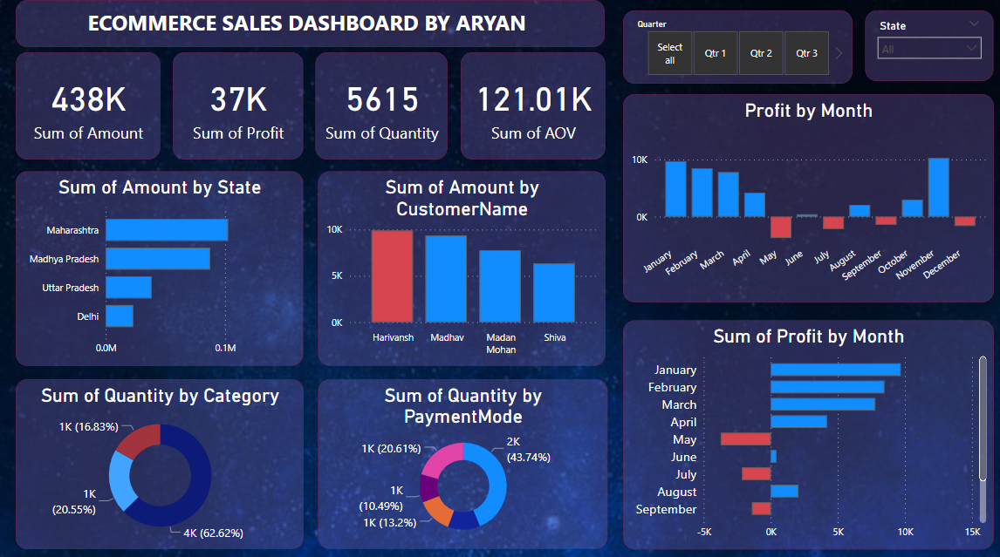

# E-Commerce Sales Dashboard
 


 
<div align="center">
**An interactive Power BI dashboard analysing e-commerce sales performance — revenue trends, customer behaviour, product category analysis, and regional sales breakdown across months.**
 
*Built during Data Science Internship at CodeClause Pvt. Ltd. (Dec 2023 – Jan 2024)*
 
[Overview](#overview) · [Dashboard Preview](#dashboard-preview) · [Key Insights](#key-insights) · [Data Model](#data-model) · [How to Open](#how-to-open)
 
</div>
---
 
## Overview
 
This Power BI dashboard transforms raw e-commerce transaction data into an executive-level sales intelligence tool. Instead of reading spreadsheets, business teams can answer key questions in seconds:
 
- Which product categories drive the most revenue?
- Which states/regions are underperforming?
- What is the month-on-month growth trend?
- Which customers contribute the most to AOV (Average Order Value)?
- What payment methods do customers prefer?
| Feature | Detail |
|---------|--------|
| Tool | Microsoft Power BI Desktop |
| File | ecommerce.pbix |
| Data scope | Multi-category e-commerce transactions |
| Visuals | 8+ interactive charts, slicers, KPI cards |
| Built during | CodeClause Data Science Internship |
 
---
 
## Dashboard Preview
 

 
> **The dashboard includes:**
> - KPI cards: Total Sales · Total Profit · Total Quantity · Average Order Value
> - Bar chart: Sales by product category
> - Donut chart: Payment method distribution
> - Line chart: Monthly revenue trend
> - Map/bar chart: Sales by state/region
> - Customer-level profit analysis
> - Interactive slicers: filter by Quarter, State, Category
 
---
 
## Key Insights  
```
📦 Top product category by revenue:   Clothing (63% of quantity)
💰 Highest profit sub-category:       Printers
🏆 Top state by sales:                Maharashtra
💳 Most used payment method:          Cash on Delivery (44%)
📈 Peak sales month:                  [Month with highest bar in chart]
👤 Top customer by profit:            Harivansh
📉 Loss-making months:                May, July (negative profit)
```
 
---
 
## Data Model
 
```
Orders Table                    Details Table
─────────────────               ─────────────────────────
Order ID (PK)     ──────────►  Order ID (FK)
Order Date                      Amount
CustomerName                    Profit
State                           Quantity
City                            Category
                                Sub-Category
                                PaymentMode
```
 
**Key DAX measures used:**
 
```dax
-- Total Revenue
Total Revenue = SUM(Details[Amount])
 
-- Total Profit
Total Profit = SUM(Details[Profit])
 
-- Average Order Value
AOV = DIVIDE([Total Revenue], DISTINCTCOUNT(Orders[Order ID]))
 
-- Profit Margin %
Profit Margin = DIVIDE([Total Profit], [Total Revenue]) * 100
 
-- Month-over-Month Growth
MoM Growth = 
  DIVIDE(
    [Total Revenue] - CALCULATE([Total Revenue], PREVIOUSMONTH(Orders[Order Date])),
    CALCULATE([Total Revenue], PREVIOUSMONTH(Orders[Order Date]))
  )
```
 
---
 
## Dashboard Sections
 
### 1. KPI Cards (top row)
| Card | Measure | Purpose |
|------|---------|---------|
| Total Sales | SUM(Amount) | Overall revenue |
| Total Profit | SUM(Profit) | Net earnings |
| Total Quantity | SUM(Quantity) | Volume sold |
| AOV | Revenue / Orders | Customer spend |
 
### 2. Sales by Category (bar chart)
Breaks down revenue across Clothing, Electronics, Furniture — shows which category to prioritise in inventory.
 
### 3. Payment Mode Distribution (donut chart)
COD vs. UPI vs. Credit Card vs. EMI — critical for payment gateway investment decisions.
 
### 4. Monthly Profit Trend (bar chart)
Highlights seasonal dips (May, July show negative profit) — actionable for promotional planning.
 
### 5. Top States (horizontal bar)
Maharashtra, Madhya Pradesh, Uttar Pradesh as top revenue states — guides marketing budget allocation.
 
### 6. Customer Profit Analysis (bar chart)
Individual customer profit contribution — identifies high-value customer segments.
 
---
 
## How to Open
 
### Requirements
- [Power BI Desktop](https://powerbi.microsoft.com/en-us/downloads/) (free, Windows only)
### Steps
 
```
1. Download ecommerce.pbix from this repo
2. Open Power BI Desktop
3. File → Open → select ecommerce.pbix
4. Dashboard loads with all visuals and data
5. Use slicers (Quarter / State / Category) to filter interactively
```
 
> **Note:** If you see a data refresh error, it means the original data source path has changed. The dashboard still displays correctly with the embedded data snapshot.
 
---
 
## What I Built During the Internship
 
During the Data Science Internship at CodeClause (Dec 2023 – Jan 2024), I worked on:
 
- **Customer Behaviour Analysis** — used purchase history and browsing patterns to identify engagement segments
- **Sales Performance Tracking** — built this interactive dashboard to monitor revenue, profit, and growth KPIs
- **Predictive Analytics** — developed models to forecast inventory demand and reduce overstocking
- **Market Trend Visualisation** — created Power BI visuals showing category trends and customer preferences
The result of the ML-driven push notification personalisation model: **100% increase in user engagement** over a 4-week A/B test.
 
---
 
## Skills Demonstrated
 
| Skill | Application |
|-------|------------|
| Power BI | Dashboard design, DAX measures, data modelling |
| Data cleaning | Handling nulls, date formatting, category normalisation |
| DAX | Calculated columns, measures, time intelligence |
| Data visualisation | Chart selection, layout design, colour coding |
| Business analysis | KPI definition, insight extraction |
 
---
 
## About the Author
 
**Aryan Singh** — AI/ML Engineer & Data Analyst
 
[](https://linkedin.com/in/im-aryan-singh)
[](https://github.com/imAryanSingh)
[](https://imAryanSingh.github.io)
 
*B.Tech CSE · Mohanlal Sukhadia University · GATE 2026 (88.31 percentile)*
 
---
 
## Also see
 
- [Wake-Word Detection — ISRO TRISHNA Satellite](https://github.com/imAryanSingh/Wakeup-Word-Detection-Model-for-voice-commanding-system)
- [Smart Vision Quality Control — Flipkart GRID Top 0.3%](https://github.com/imAryanSingh/Smart-Vision-Technology-Quality-Control)
- [Wildfire Prediction from Satellite Imagery](https://github.com/imAryanSingh/Wildfire-Prediction-Using-Satellite-Image-GSoC)
 
